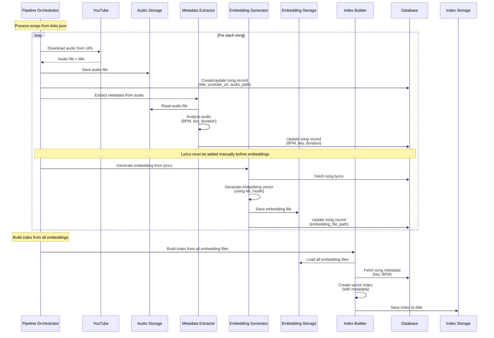

# Pipeline Sequence Diagram

High-level sequence diagram of the data processing pipeline from download to index building.

```mermaid
sequenceDiagram
    participant Pipeline as Pipeline Orchestrator
    participant YouTube as YouTube
    participant AudioStorage as Audio Storage
    participant MetadataExtractor as Metadata Extractor
    participant EmbeddingGenerator as Embedding Generator
    participant EmbeddingStorage as Embedding Storage
    participant IndexBuilder as Index Builder
    participant Database as Database
    participant IndexStorage as Index Storage

    Note over Pipeline: Process songs from links.json

    loop For each song
        Pipeline->>YouTube: Download audio from URL
        YouTube-->>Pipeline: Audio file + title
        Pipeline->>AudioStorage: Save audio file
        Pipeline->>Database: Create/update song record<br/>(title, youtube_url, audio_path)

        Pipeline->>MetadataExtractor: Extract metadata from audio
        MetadataExtractor->>AudioStorage: Read audio file
        MetadataExtractor->>MetadataExtractor: Analyze audio<br/>(BPM, key, duration)
        MetadataExtractor->>Database: Update song record<br/>(BPM, key, duration)

        Note over Pipeline,Database: Lyrics must be added manually before embeddings

        Pipeline->>EmbeddingGenerator: Generate embedding from lyrics
        EmbeddingGenerator->>Database: Fetch song lyrics
        EmbeddingGenerator->>EmbeddingGenerator: Generate embedding vector<br/>(using ML model)
        EmbeddingGenerator->>EmbeddingStorage: Save embedding file
        EmbeddingGenerator->>Database: Update song record<br/>(embedding_file_path)
    end

    Note over Pipeline: Build index from all embeddings

    Pipeline->>IndexBuilder: Build index from all embedding files
    IndexBuilder->>EmbeddingStorage: Load all embedding files
    IndexBuilder->>Database: Fetch song metadata<br/>(key, BPM)
    IndexBuilder->>IndexBuilder: Create vector index<br/>(with metadata)
    IndexBuilder->>IndexStorage: Save index to disk
```
