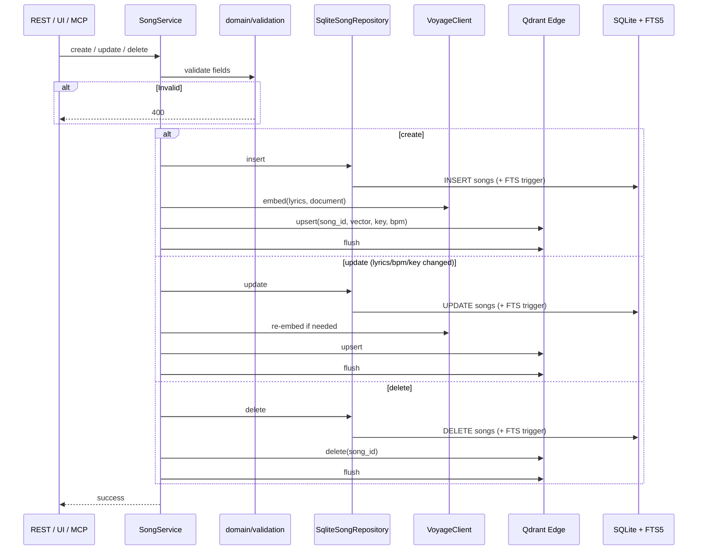

# Catalog Write Sequence

Songs are written through **REST**, **UI**, or **MCP**; `SongService` keeps SQLite, FTS5, Voyage, and Qdrant Edge in sync.

## Storage

| Asset | Location | Notes |
|-------|----------|--------|
| Catalog | `data/medley.db` | SQLite + FTS5 |
| Vectors | `data/edge_shard/` | Qdrant Edge shard (created/updated on each write) |

## Write path (create / update / delete)



## Running the server

```bash
cargo run -p medley-server
```

Single process on `:9876` — REST (`/api/*`), web UI, MCP (`/mcp`), health (`/health`).
