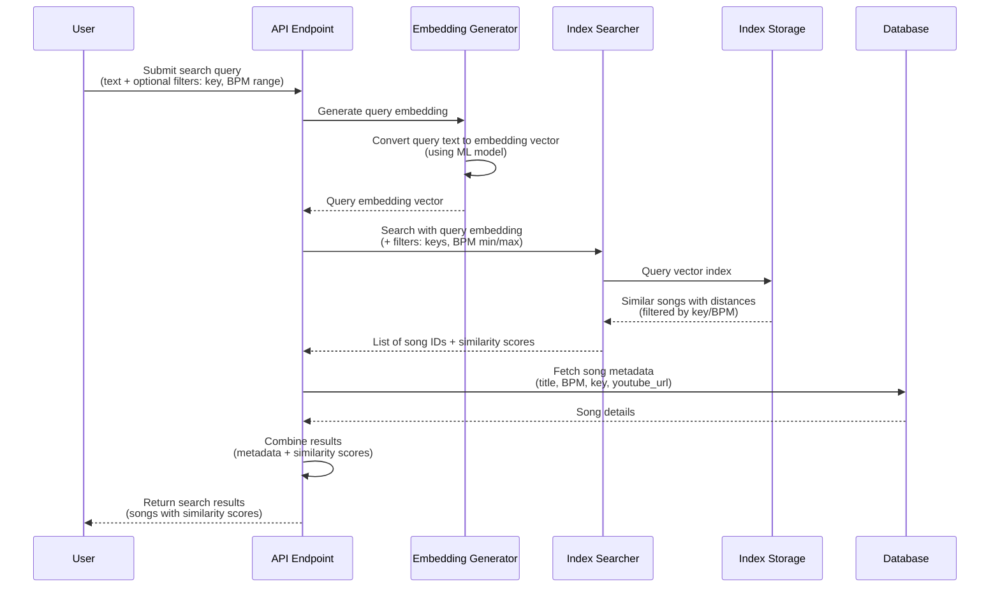

# Search Sequence Diagram

High-level sequence diagram of the search process from user input to response.

```mermaid
sequenceDiagram
    participant User as User
    participant API as API Endpoint
    participant EmbeddingGenerator as Embedding Generator
    participant IndexSearcher as Index Searcher
    participant IndexStorage as Index Storage
    participant Database as Database

    User->>API: Submit search query<br/>(text + optional filters: key, BPM range)

    API->>EmbeddingGenerator: Generate query embedding
    EmbeddingGenerator->>EmbeddingGenerator: Convert query text to embedding vector<br/>(using ML model)
    EmbeddingGenerator-->>API: Query embedding vector

    API->>IndexSearcher: Search with query embedding<br/>(+ filters: keys, BPM min/max)
    IndexSearcher->>IndexStorage: Query vector index
    IndexStorage-->>IndexSearcher: Similar songs with distances<br/>(filtered by key/BPM)

    IndexSearcher-->>API: List of song IDs + similarity scores

    API->>Database: Fetch song metadata<br/>(title, BPM, key, youtube_url)
    Database-->>API: Song details

    API->>API: Combine results<br/>(metadata + similarity scores)
    API-->>User: Return search results<br/>(songs with similarity scores)
```

