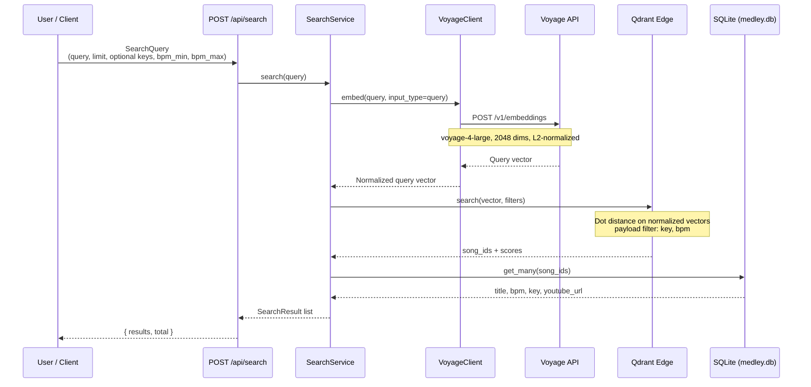

# Search Sequence Diagram

Semantic search via `POST /api/search` — Voyage query embedding, Qdrant Edge nearest-neighbor search, optional key/BPM payload filters, SQLite metadata join.

## Prerequisites

- Qdrant Edge shard at `EDGE_SHARD_PATH` (default `data/edge_shard`)
- `VOYAGE_API_KEY` set (each search embeds the query)
- Catalog rows in `DATABASE_PATH` (default `data/medley.db`)
- Vectors indexed in Edge (`data/edge_shard/`, committed for deployment alongside `medley.db`)

After catalog changes, rebuild and commit the shard:

```bash
cargo run -p medley-server -- reindex
```



## Similarity score

Edge returns a dot-product score on L2-normalized vectors (higher = more similar). Results preserve Edge rank order.
